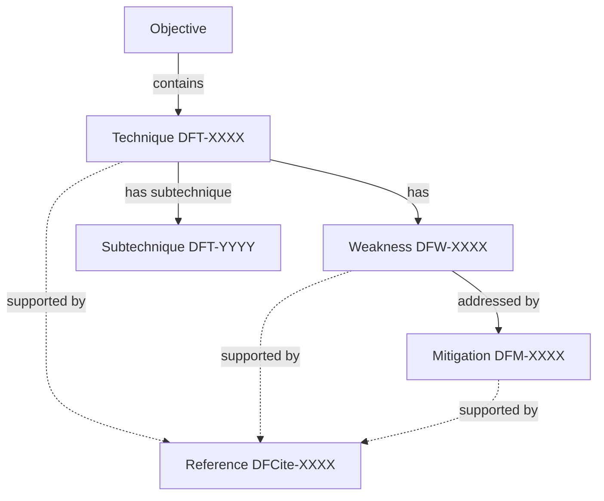
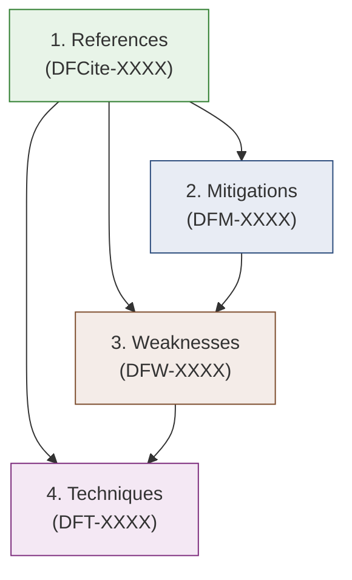
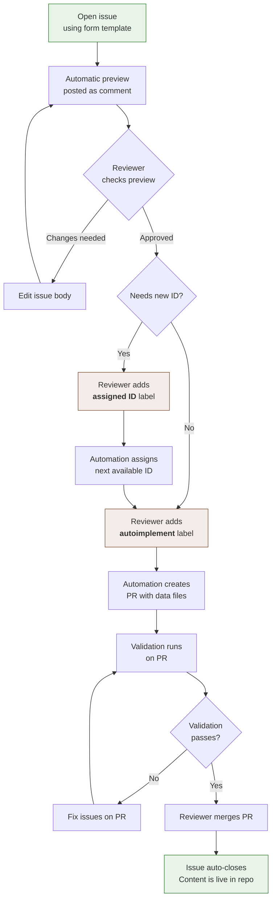
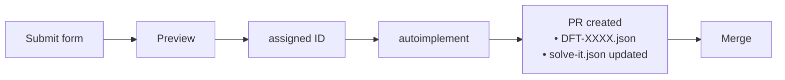
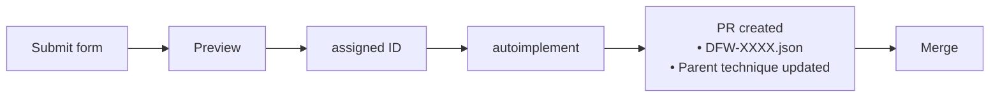
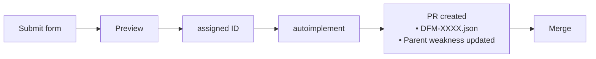
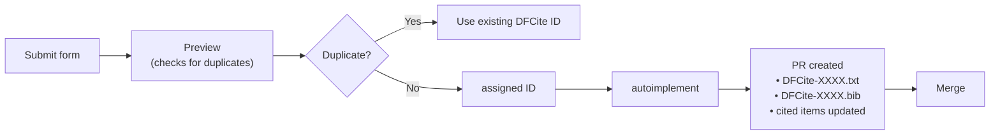
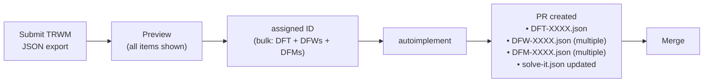
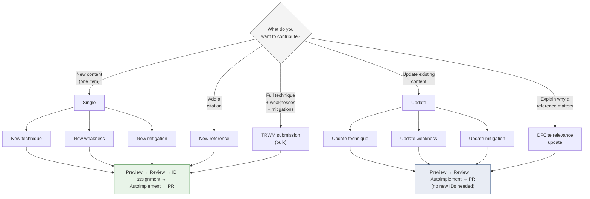

# SOLVE-IT Detailed Contributor Guide

This guide walks you through the different types of contributions you can make to the SOLVE-IT knowledge base, and how the automated pipeline processes them. For general information about the project and its data model, see [README.md](README.md). For style guidance, see [STYLE_GUIDE.md](STYLE_GUIDE.md).

---

## Overview

The SOLVE-IT knowledge base is built from five core concepts:

| Concept | ID format | Description | Example |
|---|---|---|---|
| **Objective** | `DFO-XXXX` | A goal in a digital forensic investigation | _Acquire data_ |
| **Technique** | `DFT-XXXX` | A method to achieve an objective | _Create disk image_ |
| **Weakness** | `DFW-XXXX` | A potential problem when using a technique | _Excluding a device containing relevant data_ |
| **Mitigation** | `DFM-XXXX` | An action to prevent or reduce a weakness | _Use dual tool verification_ |
| **Reference** | `DFCite-XXXX` | A citation supporting any of the above | _A journal paper, standard, or URL_ |

Objectives are the top-level organising structure (based on ATT&CK tactics) and are managed by the project maintainers. The four content types below them are open for community contributions.

These are connected in a hierarchy:



---

## What can I contribute?

### Individual items

You can propose any of the following as standalone contributions:

- **A new technique** — a method for achieving a forensic objective
- **A new weakness** — a potential problem with an existing technique
- **A new mitigation** — a way to prevent or reduce a weakness
- **A new reference** — a citation to support existing or new content
- **An update** to any existing technique, weakness, or mitigation
- **A DFCite relevance summary** — a 280-character explanation of why a reference is relevant to a specific item

### Bulk submissions (TRWM)

If you have a complete technique with its weaknesses and mitigations ready, you can submit them all at once using a **TRWM (Technique, Risk, Weakness, Mitigation) submission**. This is ideal when you've used the TRWM Helper worksheets to develop a full analysis.

---

## Deciding what order to contribute

Because items reference each other, there are several ways to approach the order of your contributions depending on how much detail you have ready.

### Path A: Start with a technique (and add detail later)

If you want to get a technique into the knowledge base quickly, you can propose it on its own — weaknesses, mitigations, and references can all be added later by you or others.

1. **Technique** — propose the technique with whatever detail you have.
2. **Weaknesses, mitigations, references** — add these over time as separate submissions.

### Path B: Bottom-up (full detail from the start)

If you have a complete analysis ready, work bottom-up so that each item can reference the ones before it. The general rule is: **create referenced items before the items that reference them**.



1. **References first** — if your contribution cites papers, standards, or URLs that aren't already in SOLVE-IT, propose them first so they get `DFCite-XXXX` IDs you can use in later submissions.
2. **Mitigations** — create these next. You'll need their `DFM-XXXX` IDs when proposing weaknesses.
3. **Weaknesses** — propose weaknesses, referencing the mitigation IDs from step 2. You'll need the `DFW-XXXX` IDs when proposing the technique.
4. **Technique** — propose the technique last, referencing the weakness IDs from step 3.

### Path C: TRWM bulk submission

If you have a complete technique with all its weaknesses and mitigations ready, use a **TRWM submission** to propose everything in a single issue. The automation handles the ordering for you.

### Other contributions

You don't need to follow any of these paths to contribute a standalone weakness, mitigation, or reference. These can be proposed individually at any time.

---

## Before you start

### Check if it already exists

Before proposing new content, search the knowledge base:

- **[SOLVE-IT Explorer](https://explore.solveit-df.org/)** — browse and search the full knowledge base
- **[MCP Server](https://github.com/CKE-Proto/solve_it_mcp)** — query via natural language using an LLM
- **[Machine-readable data](https://data.solveit-df.org)** — TSV and other formats for bulk checking

If the content already exists but needs updating, use an update form instead of proposing a new item. You can do this directly from the [SOLVE-IT Explorer](https://explore.solveit-df.org/) using the "Propose an update" button, which will prepopulate the form with the existing data for ease of editing.

### Check open issues

Look at [open issues](https://github.com/SOLVE-IT-DF/solve-it/issues) to see if someone else has already proposed what you're planning. You may be able to add to their proposal instead of duplicating effort.

---

## The contribution pipeline

All contributions follow the same automated pipeline. You open a GitHub issue using a form, and the automation handles the rest with reviewer oversight.



### What happens at each step

| Step | Who | What happens |
|---|---|---|
| **Open issue** | You | Fill in the GitHub issue form for your content type |
| **Preview** | Automation | A bot comment appears showing the parsed JSON — check it looks right |
| **ID assignment** | Reviewer | Reviewer adds the `assigned ID` label; automation finds the next free ID and posts it |
| **Auto-implement** | Reviewer | Reviewer adds the `autoimplement` label; automation creates a PR with the data files |
| **Validation** | Automation | KB validation and tests run on the PR; results posted as a comment |
| **Merge** | Reviewer | Reviewer merges the PR; the issue auto-closes |

Once merged, your content is live in the knowledge base repository. The [SOLVE-IT Explorer](https://explore.solveit-df.org/) and [data site](https://data.solveit-df.org) sync periodically, so it may take a short time before your contribution appears there.

> **You only need to do step 1.** Everything else is handled by reviewers and automation. If changes are needed, the reviewer will comment on your issue.

---

## Mapping your research to SOLVE-IT

If you're coming from published research, two guiding questions help determine what to contribute:

1. **"Does this work identify a problem in digital forensics?"** → You likely have a **weakness** to contribute.
   - Does the weakness apply to an existing technique? → Propose a new weakness linked to that technique.
   - Does it relate to a technique not yet in SOLVE-IT? → Propose both the technique and the weakness.

2. **"Does this work solve a problem in digital forensics?"** → You likely have a **mitigation** or **technique** to contribute.
   - Is the solution a simple action that reduces a known weakness? → Propose a new mitigation.
   - Is the solution a broader method or process? → Propose a new technique (and consider whether it also introduces new weaknesses and mitigations).
   - A mitigation can also link to a technique — this happens when the mitigation is complex enough to have its own weaknesses. For example, "use a write blocker" is a mitigation for weaknesses in disk imaging, but write blocking is itself a technique (with its own weaknesses and mitigations).

Many research outputs map to multiple items — a single paper might contribute a technique, several weaknesses, and their mitigations. Submit each item individually using the appropriate form, or use a TRWM bulk submission if you have a complete set.

### Examples from published research

These examples illustrate the different scales of contribution:

- **[Vanini et al. (2024)](https://doi.org/10.1016/j.fsidi.2024.301759) — time anchors**: After publication, identified weaknesses in timestamp interpretation ([DFW-1148](https://explore.solveit-df.org/#DFW-1148), [DFW-1267](https://explore.solveit-df.org/#DFW-1267)), developed mitigations ([DFM-1225](https://explore.solveit-df.org/#DFM-1225)), and the work became the basis for a new technique ([DFT-1134](https://explore.solveit-df.org/#DFT-1134)). Started with a problem, led to both weaknesses and a technique.

- **[Schneider et al. (2024)](https://doi.org/10.1016/j.fsidi.2024.301761) — digital stratigraphy**: After publication, identified a weakness in file system attribution ([DFW-1106](https://explore.solveit-df.org/#DFW-1106)) and developed a specific mitigation ([DFM-1061](https://explore.solveit-df.org/#DFM-1061)). A focused contribution: one weakness, one mitigation.

- **[Hargreaves et al. (2025)](https://ora.ox.ac.uk/objects/uuid:c46ead55-3979-4859-933a-eda812ee9062/files/s3r074x57c) — Replika AI app**: Used a full TRWM analysis producing technique [DFT-1128](https://explore.solveit-df.org/#DFT-1133) plus 27 weaknesses and 18 mitigations. Demonstrates using the TRWM bulk submission for comprehensive analysis.

---

## Relevancy Strings

Every reference (DFCite) attached to a technique, weakness, or mitigation includes a **relevancy string** — a short explanation (max 280 characters) of *why* that reference matters to the specific item it is cited in. In the data files, this field is called `relevance_summary_280`:

```json
{
    "DFCite_id": "DFCite-1018",
    "relevance_summary_280": "Provides the definition used in the description of this technique."
}
```

### Why relevancy strings matter

A reference on its own only tells you *what* was cited. The relevancy string tells readers *why* — what specific insight, evidence, or definition the reference contributes to the item. This is especially important because the same reference can be cited across multiple techniques, weaknesses, and mitigations for different reasons.

Relevancy strings are also useful for pointing readers to the right part of a source. For books, you can direct them to a specific chapter or page range; for papers, you can reference the subsection that discusses a particular weakness or technique. This saves readers from having to search through an entire publication to find the relevant content.

Unlike a search engine, which can find a paper but leaves you to work out *which part* is relevant and *why it matters* to a specific forensic problem, a relevancy string provides curated, expert context. A practitioner reading about a weakness doesn't need to skim an entire paper to find the relevant discussion — the relevancy string tells them exactly what to look for and why.

### Writing a good relevancy string

- **Focus on the connection**, not the reference itself. Explain what the reference contributes to *this specific item*.
- **Use active voice** and be specific.
- **Maximum 280 characters** — think of it as a tweet-length explanation.

| Good | Why it works |
|---|---|
| _"Provides the definition used in the description of this technique."_ | Explains the specific role of the reference |
| _"Demonstrates that Tool X misreports timestamps under condition Y."_ | Points to the specific finding that supports the weakness |
| _"Proposes the mitigation approach described here and evaluates it against three case studies."_ | Explains how the reference underpins the mitigation |

| Avoid | Why |
|---|---|
| _"A paper about Tool X."_ | Describes the reference, not its relevance to the item |
| _"Relevant paper."_ | Too vague to be useful |

### How to contribute relevancy strings

Many existing references have empty relevancy strings — these are shown as faded entries in the [SOLVE-IT Explorer](https://explore.solveit-df.org/), signalling that a contribution is welcome.

To add or update a relevancy string, use the **[Update DFCite relevance](https://github.com/SOLVE-IT-DF/solve-it/issues/new?template=2e_update-dfcite-relevance-form.yml)** form. You'll need:

- The **item ID** the reference is attached to (e.g. `DFT-1005`, `DFW-1106`, or `DFM-1061`)
- The **DFCite ID** (e.g. `DFCite-1018`)
- Your **relevancy string** (1–280 characters)

This is one of the simplest ways to contribute — no new IDs are needed, and the pipeline is streamlined: Preview → Auto-implement → PR → Merge.

---

## How to submit each content type

### New technique

**Form:** [Propose a new technique](https://github.com/SOLVE-IT-DF/solve-it/issues/new?template=1a_propose-new-technique-form.yml)

**Required fields:**
- Technique name
- Description
- Objective (selected from dropdown)

**Optional fields:**
- Parent technique (if this is a subtechnique)
- Synonyms, details, examples (tools, datasets, cases that illustrate the technique)
- Existing weakness IDs (e.g. `DFW-1001, DFW-1023`)
- Propose new weaknesses (free text — these become separate issues)
- Ontology input/output classes
- References (DFCite IDs only — [create the reference first](#new-reference) if it doesn't already exist, or mention the citation in the notes field and add the DFCite ID to the technique later)

**Pipeline:** Preview → ID assignment → Auto-implement → PR → Merge



**What gets created:**
- `data/techniques/DFT-XXXX.json`
- `data/solve-it.json` updated with the technique under its objective

---

### New weakness

**Form:** [Propose a new weakness](https://github.com/SOLVE-IT-DF/solve-it/issues/new?template=1b_propose-new-weakness-form.yml)

**Required fields:**
- Weakness name

**Optional fields:**
- Description
- ASTM error class(es) (see [Style Guide — Weakness categories](STYLE_GUIDE.md#weakness-categories) for full definitions):
  - `ASTM_INCOMP` — incompleteness (e.g. relevant information missed)
  - `ASTM_INAC_EX` — inaccuracy: existence (e.g. artefact reported that doesn't exist)
  - `ASTM_INAC_AS` — inaccuracy: association (e.g. items incorrectly linked)
  - `ASTM_INAC_ALT` — inaccuracy: alteration (e.g. data modified)
  - `ASTM_INAC_COR` — inaccuracy: corruption (e.g. corrupt data not detected)
  - `ASTM_MISINT` — misinterpretation (e.g. results encourage wrong conclusions)
- Existing mitigation IDs
- Propose new mitigations (free text)
- Techniques this weakness applies to
- References (DFCite IDs only — [create the reference first](#new-reference) if it doesn't already exist, or mention the citation in the notes field and add the DFCite ID to the weakness later)

**Pipeline:** Preview → ID assignment → Auto-implement → PR → Merge



**What gets created:**
- `data/weaknesses/DFW-XXXX.json`
- Parent technique's `weaknesses` list is automatically updated

---

### New mitigation

**Form:** [Propose a new mitigation](https://github.com/SOLVE-IT-DF/solve-it/issues/new?template=1c_propose-new-mitigation-form.yml)

**Required fields:**
- Mitigation name

**Optional fields:**
- Description
- Existing weakness IDs this mitigates
- Linked technique ID (e.g. `DFT-1002`, if this mitigation is complex enough to have its own technique entry)
- References (DFCite IDs only — [create the reference first](#new-reference) if it doesn't already exist, or mention the citation in the notes field and add the DFCite ID to the mitigation later)

**Pipeline:** Preview → ID assignment → Auto-implement → PR → Merge



**What gets created:**
- `data/mitigations/DFM-XXXX.json`
- Parent weakness's `mitigations` list is automatically updated

---

### New reference

**Form:** [Propose a new reference](https://github.com/SOLVE-IT-DF/solve-it/issues/new?template=1d_propose-new-reference-form.yml)

**Required fields:**
- Citation text (Harvard style or URL)

**Optional fields:**
- BibTeX entry
- Cite in items — specify items (techniques, weaknesses, mitigations) where this reference should be cited, one per line in `ITEM_ID | relevance summary` format. The auto-implement PR will add the reference to these items automatically.
- Notes on where it's used and why it's relevant

**Pipeline:** Preview → ID assignment → Auto-implement → PR → Merge



**What gets created:**
- `data/references/DFCite-XXXX.txt` (citation text)
- `data/references/DFCite-XXXX.bib` (BibTeX, if provided)
- If "Cite in items" was specified: the referenced items' JSON files are updated with the new DFCite entry


It is worth supplying bibtex if you can since the SOLVE-IT Explorer offers direct copying of the bibtex citation file from within the UI, making it easy to refer to. 

> **Duplicate detection:** The preview step checks if your citation matches an existing reference. If it does, you'll be told to use the existing DFCite ID instead.

---

### TRWM bulk submission

**Form:** [Submit a TRWM](https://github.com/SOLVE-IT-DF/solve-it/issues/new?template=3_propose-trwm-submission-form.yml)

This is the recommended way to submit a complete technique with all its weaknesses and mitigations at once.

**Required fields:**
- Submission type (new technique or update to existing)
- Objective
- TRWM Helper JSON export

**Optional fields:**
- Propose new objective
- Parent technique (for subtechniques)
- Additional notes

**Pipeline:** Preview → ID assignment (all items at once) → Auto-implement → PR → Merge



**What gets created:**
- One technique file
- Multiple weakness files
- Multiple mitigation files
- `solve-it.json` updated
- All cross-references linked automatically

---

### Update an existing item

There are separate update forms for each content type:

- [Update a technique](https://github.com/SOLVE-IT-DF/solve-it/issues/new?template=2a_update-technique-form.yml)
- [Update a weakness](https://github.com/SOLVE-IT-DF/solve-it/issues/new?template=2b_update-weakness-form.yml)
- [Update a mitigation](https://github.com/SOLVE-IT-DF/solve-it/issues/new?template=2c_update-mitigation-form.yml)
- [Update DFCite relevance](https://github.com/SOLVE-IT-DF/solve-it/issues/new?template=2e_update-dfcite-relevance-form.yml)

**How updates work:**
- You must provide the existing item's ID (e.g. `DFT-1002`)
- Leave any field blank to keep its current value
- Filling in a list field (like weakness IDs) **replaces the entire list** — include all values you want to keep
- "Propose new" fields are additive — new items are created alongside existing ones

> **Tip:** You can submit updates directly from the [SOLVE-IT Explorer](https://explore.solveit-df.org/) using the "Propose an update" button on any item's page. This pre-fills the ID and links you to the correct form.

**Pipeline for DFCite relevance updates:** Preview → Auto-implement (no ID assignment needed)

**Pipeline for other updates:** Preview → Discussion → Auto-implement

**Revising a proposal after discussion:**
If discussion on an update issue leads to changes from the original proposal, anyone can post a revised version:
1. Copy the JSON from the bot's `### Proposed` block
2. Edit it with the agreed-upon changes
3. Post a new comment with a `### Proposed` heading followed by the revised JSON in a `` ```json `` code block
4. The bot will automatically validate the revised JSON and post a result
5. When ready, a reviewer adds the `autoimplement` label — auto-implement uses the **most recent** `### Proposed` comment

---

---

## Tips and common questions

### References

- **Only DFCite IDs are accepted** in the references field of technique, weakness, and mitigation forms (e.g. `DFCite-1001`). Free-text citations are not accepted.
- If your reference doesn't exist yet, create it first using the [Propose new reference](https://github.com/SOLVE-IT-DF/solve-it/issues/new?template=1d_propose-new-reference-form.yml) form, then use the assigned DFCite ID in your submission.
- Always check if a reference already exists before proposing a new one — the preview will flag duplicates
- Include a **relevance summary** (max 280 characters) explaining why each reference matters to the specific item
- **Inline citations:** You can cite references directly in description, details, and examples text fields using `[DFCite-xxxx]` (e.g. `[DFCite-1018]`). These are rendered as citation links in the Explorer. The validator checks that any inline-cited DFCite IDs exist in the knowledge base.

### Common mitigations

Some mitigations are broadly applicable and worth knowing about:
- **DFM-1027** Use dual tool verification
- **DFM-1050** Manually verify relevant data
- **DFM-1055** Correlation of data extracted with data from service provider

### Workflow-based research

Some research outputs map to multiple techniques as part of a workflow (e.g., a multi-step acquisition process). Submit each technique individually, and consider the [SOLVE-IT examples repository](https://github.com/SOLVE-IT-DF/solve-it-examples) for documenting how techniques combine into workflows.

### Submitting from the Explorer

The [SOLVE-IT Explorer](https://explore.solveit-df.org/) has direct links to the issue forms:
- **"Propose an update"** button on any technique, weakness, or mitigation page — pre-fills the item ID
- **"Propose a new..."** buttons on the Techniques, Weaknesses, Mitigations, and References tabs

### What if I don't have all the information?

Partial contributions are welcome. You can:
- Propose a technique without weaknesses or mitigations
- Propose a weakness without mitigations
- Leave optional fields blank

Others can build on your contribution later.

### What if my reference doesn't exist yet?

Create the reference first using the [Propose new reference](https://github.com/SOLVE-IT-DF/solve-it/issues/new?template=1d_propose-new-reference-form.yml) form. Once it has been assigned a DFCite ID and merged, you can use that ID in your technique, weakness, or mitigation submission.

If you submit a DFCite ID that doesn't exist in the knowledge base, the preview will flag it as an error. If you submit free-text citation text instead of a DFCite ID, it will be rejected — only DFCite IDs are accepted in the references field. If you want to proceed without the reference, you can leave the references field blank (mentioning the citation in the notes field if helpful) and add the DFCite ID later via an update form once the reference has been created.

---

## Summary of all submission types



---

## Further reading

- [CONTRIBUTING.md](CONTRIBUTING.md) — quick-start contribution overview
- [STYLE_GUIDE.md](STYLE_GUIDE.md) — writing standards, naming conventions, weakness categories, and reference formatting
- [SOLVE-IT for Researchers](https://github.com/SOLVE-IT-DF/solve-it-education/tree/main/guide-for-researchers) — extended guide for research contributors
- [SOLVE-IT Explorer](https://explore.solveit-df.org/) — browse and search the knowledge base
