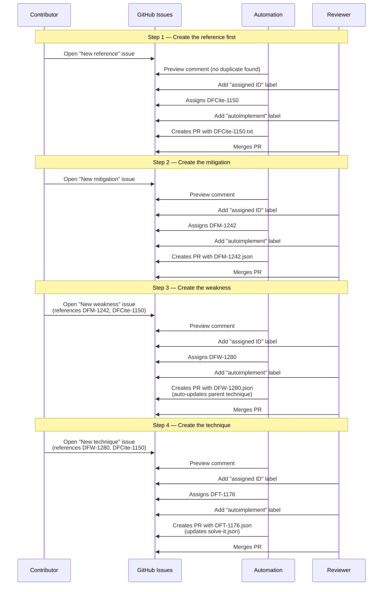

# Reviewer / Admin Guide

This guide covers how to process issue submissions through to the knowledge base. It is aimed at project collaborators who have permission to add labels and merge PRs.

## Access control

Only repository collaborators (users with triage access or above) can trigger the automation pipeline. The two control points are:

- **`assigned ID`** label — triggers ID assignment
- **`autoimplement`** label — triggers PR creation

Anyone can open an issue on this public repository, but only collaborators can move it through the pipeline.

---

## Pipeline overview

Every submission follows the same general flow:

```
Issue opened → Preview comment → ID assignment → Auto-implement → PR → Validation → Merge
```

Some content types skip steps (e.g. updates don't need new IDs). The table below shows which steps apply, along with the labels automatically applied by the issue form.

| Content type | Auto labels | Preview | ID assignment | Auto-implement | Notes |
|---|---|---|---|---|---|
| New technique | `content: new technique`, `form input` | Yes | Yes (`assigned ID`) | Yes (`autoimplement`) | Updates `solve-it.json`; does **not** auto-update linked weakness files |
| New weakness | `content: new weakness`, `form input` | Yes | Yes (`assigned ID`) | Yes (`autoimplement`) | Auto-adds to parent technique's weakness list |
| New mitigation | `content: new mitigation`, `form input` | Yes | Yes (`assigned ID`) | Yes (`autoimplement`) | Auto-adds to parent weakness's mitigation list |
| New reference | `content: new reference`, `form input` | Yes | Yes (`assigned ID`) | Yes (`autoimplement`) | Skips if duplicate detected |
| TRWM submission | `trwm` | Yes | Yes (`assigned ID`) | Yes (`autoimplement`) | Bulk: technique + weaknesses + mitigations in one issue |
| DFCite relevance update | `content: update dfcite relevance`, `form input` | Yes | No (existing IDs) | Yes (`autoimplement`) | Updates a single field in an existing item |

---

## Step-by-step: processing a submission

### Step 1: Issue is opened (automatic)

When a contributor opens an issue using one of the GitHub issue forms, two things happen automatically:

1. Labels are applied by the issue template (e.g. `content: new technique`, `form input`)
2. The **issue-preview** workflow runs, parsing the form fields and posting a preview comment with the proposed JSON data

**What to check:**
- Does the preview JSON look correct?
- Are the fields reasonable (name, description, references)? See the [Style Guide](../STYLE_GUIDE.md) for naming conventions and writing standards
- For techniques: is the right objective selected?
- For weaknesses: are the ASTM error classes appropriate?

If the submission needs changes, comment on the issue asking the contributor to update it. They can edit the issue body and reopen to trigger a fresh preview.

### Step 2: Assign an ID

Once you're satisfied with the preview, add the **`assigned ID`** label. This triggers the ID assignment workflow, which:

1. Scans all existing data files and open issues/PRs for used IDs
2. Finds the next available ID (e.g. `DFT-1176`, `DFW-1280`, `DFM-1241`)
3. Posts a new comment with the real ID replacing the placeholder (`DFT-____`)

**What to check:**
- Verify the ID assignment comment appears
- The JSON block should now show a real ID, not a placeholder

> **Note:** For TRWM submissions, all IDs (technique + weaknesses + mitigations) are assigned in a single step.
>
> **Note:** DFCite relevance updates skip this step since they modify existing items.

### Step 3: Auto-implement

Add the **`autoimplement`** label. This triggers the appropriate auto-implement workflow, which:

1. Extracts the JSON from the assigned-ID comment
2. Writes the data file(s) to the correct location under `data/`
3. For techniques: updates `solve-it.json` to link the technique under its objective
4. Creates a branch and PR attributed to the original submitter
5. Runs KB validation and posts results on the PR

**What to check on the PR:**
- Review the generated data file(s)
- Check the validation comment — it should say "Passed"
- Look for any warnings in the PR body (e.g. missing DFCite references, cross-references that need manual attention)

### Step 4: Merge

If validation passes and the PR looks good, merge it. The issue will be automatically closed by the `Resolves #NNN` line in the PR body.

---

## Content type details

### New technique / weakness / mitigation

**Labels required:** `content: new technique` (or weakness/mitigation) + `form input`

**Pipeline:** Preview → `assigned ID` → `autoimplement`

**Workflows:**
- Preview: `issue-preview.yml`
- ID assignment: `technique-assign-id.yml`
- Auto-implement: `autoimplement-new-item.yml` → `admin/autoimplement_new_item.py`

**Output files:**
- `data/techniques/DFT-XXXX.json` (techniques)
- `data/weaknesses/DFW-XXXX.json` (weaknesses)
- `data/mitigations/DFM-XXXX.json` (mitigations)
- `data/solve-it.json` (updated for techniques with an objective)

**Old-format issues:** Older issues may use IDs without the `DF` prefix (e.g. `T1165` instead of `DFT-1165`) or have references as raw strings instead of DFCite dicts. The auto-implement script handles both:
- Old IDs are normalized automatically (e.g. `M1240` → `DFM-1240`)
- Raw string references are matched against the DFCite corpus where possible; unmatched ones **block auto-implement** — the script posts a comment with pre-filled links to create the missing DFCite entries, removes the `autoimplement` label, and exits without creating a PR. Once the references are created and merged, re-add `autoimplement` to retry.

**Note:** New submissions only accept DFCite IDs in the references field. Free-text citations are rejected at the preview stage with a message directing the contributor to create the reference first using the "Propose new reference" form.

**Cross-references:** The auto-implement script automatically updates parent items — adding a new weakness ID to its parent technique's `weaknesses` list, and a new mitigation ID to its parent weakness's `mitigations` list. If a parent file is missing or the parent ID is invalid, the update is skipped and noted in the PR body as a manual step.

### New reference

**Labels required:** `content: new reference` + `form input`

**Pipeline:** Preview → `assigned ID` → `autoimplement`

**Workflows:**
- Preview: `issue-preview.yml`
- ID assignment: `technique-assign-id.yml` (uses the `assign-reference-id` job)
- Auto-implement: `autoimplement-new-reference.yml` → `admin/autoimplement_new_reference.py`

**Output files:**
- `data/references/DFCite-XXXX.txt` (citation text)
- `data/references/DFCite-XXXX.bib` (BibTeX, if provided)

**What to check before adding `assigned ID`:**
- The preview shows the citation text and file contents — verify they look correct
- If the preview says the reference matches an existing citation, no new entry is needed
- If the submitter specified "Cite in items", check the preview table — verify the item IDs and relevance summaries look reasonable, and note any "Not found" warnings

**Duplicate handling:** If the preview comment indicates the reference matches an existing citation, the auto-implement script posts a "no action needed" comment and exits without creating a PR.

**Cite in items:** If the submitter specified items to cite, the auto-implement PR will include updates to those items' JSON files (adding the DFCite reference). Check the PR diff to verify the references were added correctly. Items that were not found at implementation time are skipped and noted in the PR body.

**Race protection:** The script checks that the DFCite files don't already exist before writing, in case another submission took the same ID.

### TRWM submission

**Labels required:** `trwm`

**Pipeline:** Preview → `assigned ID` → `autoimplement`

**Workflows:**
- Preview: `issue-preview.yml`
- ID assignment: `technique-assign-id.yml` (uses the `assign-trwm-ids` job)
- Auto-implement: `autoimplement-trwm.yml` → `admin/autoimplement_trwm.py`

TRWM submissions contain a complete technique with all its weaknesses and mitigations in a single issue. The ID assignment step assigns IDs for all items in bulk.

**Bare BibTeX / plaintext references:** TRWM exports from the helper may include references as raw BibTeX (or plaintext) when the contributor hasn't picked an existing `DFCite` ID. The preview parser handles these in two stages:

1. **Strict auto-link** — if the bare reference matches an existing DFCite via URL, DOI, or normalised title + first-author surname + year, it is silently rewritten to `{"DFCite_id": "DFCite-XXXX", "relevance_summary_280": ""}`.
2. **Placeholder + near-miss candidates** — anything not confidently matched gets a `DFCite-____-N` placeholder, and the preview comment's "New references to review" section shows the original BibTeX plus any permissive near-miss candidates (title similarity ≥ 70%, same year + author, etc.).

**What to check before `assigned ID`:**
- Skim the "New references to review" section. For each placeholder, verify that none of the listed "possible existing matches" is actually the same reference.
- If any *is* a duplicate, reject the submission: ask the contributor to resubmit from the Helper with the existing `DFCite-XXXX` typed into the reference row, rather than the raw citation text.
- If no listed candidate matches (or the list is empty), the `assigned ID` label will mint new `DFCite-XXXX` IDs alongside the technique/weakness/mitigation IDs, and autoimplement will write `data/references/DFCite-XXXX.bib` as part of the PR.

New DFCites created this way start with empty `relevance_summary_280` fields — contributors can fill those in later via a "Update DFCite relevance" issue.

### DFCite relevance update

**Labels required:** `content: update dfcite relevance` + `form input`

**Pipeline:** Preview → `autoimplement` (no ID assignment step)

**Workflows:**
- Preview: `issue-preview.yml`
- Auto-implement: `autoimplement-dfcite-relevance.yml` → `admin/autoimplement_dfcite_relevance.py`

Updates the `relevance_summary_280` field for an existing DFCite reference within an existing technique, weakness, or mitigation.

---

## Troubleshooting

### Auto-implement fails with "could not find assigned-ID comment"

The script looks for a comment containing both "has been assigned" text and a JSON code block with a real ID. If neither is found, it falls back to the last comment with a JSON block containing a valid ID.

Possible causes:
- The `assigned ID` workflow hasn't run yet, or failed
- The issue was created before the automation existed (no machine-generated comments)
- The ID was assigned informally in a human comment without a JSON block

**Fix:** Check the issue comments. If there's no machine-generated JSON block with a real ID, either re-run the ID assignment workflow or manually post a comment with the correct JSON.

### Auto-implement blocked: missing DFCite references

The script found raw string references that couldn't be matched to existing DFCite entries, or referenced DFCite IDs that don't exist in `data/references/`. Instead of creating a PR with invalid data, it:
1. Posts a comment on the issue with pre-filled links to create the missing reference(s)
2. Removes the `autoimplement` label

**Fix:** Click the links in the comment to propose the missing DFCite entries. Once those PRs are merged, re-add the `autoimplement` label to the original issue.

### Auto-implement fails with "file already exists"

The data file for this ID already exists in the repository. This can happen if:
- The item was already implemented manually
- A previous auto-implement PR was merged

**Fix:** Check if the existing file is correct. If it needs updating, use the update workflow instead.

### Reference auto-implement says "no action needed"

The preview comment detected that the proposed reference matches an existing DFCite entry. No new files are needed — the contributor should use the existing DFCite ID.

### Validation fails on the PR

The auto-implement workflow runs `admin/validate_kb.py` and `pytest` against the PR branch. Common causes:
- Missing or invalid cross-references (e.g. a weakness references a mitigation that doesn't exist)
- Invalid CASE ontology URLs
- Malformed JSON

Check the validation comment on the PR for details. You can fix issues by pushing additional commits to the PR branch, or close the PR and re-run the pipeline after fixing the source issue.

---

## Workflow files reference

| Workflow file | Trigger | What it does |
|---|---|---|
| `issue-preview.yml` | Issue opened/reopened | Parses form fields, posts preview comment |
| `technique-assign-id.yml` | `assigned ID` label | Assigns IDs to new items |
| `autoimplement-new-item.yml` | `autoimplement` label + `content: new {type}` (not `trwm`) | Creates data file + PR for new T/W/M |
| `autoimplement-new-reference.yml` | `autoimplement` label + `content: new reference` | Creates DFCite files + PR |
| `autoimplement-trwm.yml` | `autoimplement` label + `trwm` | Creates all TRWM data files + PR |
| `autoimplement-dfcite-relevance.yml` | `autoimplement` label + `content: update dfcite relevance` | Updates relevance summary + PR |
| `validate-kb.yml` | PR or push to main | Runs KB validation |
| `validate-kb-comment.yml` | After `validate-kb.yml` completes | Posts validation results as PR comment |

## Scripts reference

| Script | Purpose |
|---|---|
| `admin/issue_parsers/parse_technique_issue.py` | Parse technique form → preview JSON |
| `admin/issue_parsers/parse_weakness_issue.py` | Parse weakness form → preview JSON |
| `admin/issue_parsers/parse_mitigation_issue.py` | Parse mitigation form → preview JSON |
| `admin/issue_parsers/parse_reference_issue.py` | Parse reference form → match/assign |
| `admin/id_assignment/assign_technique_id.py` | Assign next DFT-XXXX ID |
| `admin/id_assignment/assign_weakness_id.py` | Assign next DFW-XXXX ID |
| `admin/id_assignment/assign_mitigation_id.py` | Assign next DFM-XXXX ID |
| `admin/id_assignment/assign_reference_id.py` | Assign next DFCite-XXXX ID |
| `admin/id_assignment/assign_trwm_ids.py` | Assign all IDs in a TRWM submission |
| `admin/autoimplement_new_item.py` | Create data file + PR for new T/W/M |
| `admin/autoimplement_new_reference.py` | Create DFCite files + PR |
| `admin/autoimplement_trwm.py` | Create all TRWM files + PR |
| `admin/autoimplement_dfcite_relevance.py` | Update relevance summary + PR |
| `admin/validate_kb.py` | Validate entire knowledge base |

---

## End-to-end example

Here's the full sequence when a contributor proposes a new technique with a new weakness, a new mitigation, and a new reference — showing all reviewer and automation steps.



> **Or use TRWM:** If the contributor has the full technique + weaknesses + mitigations ready, a single TRWM submission handles steps 2–4 in one issue.
